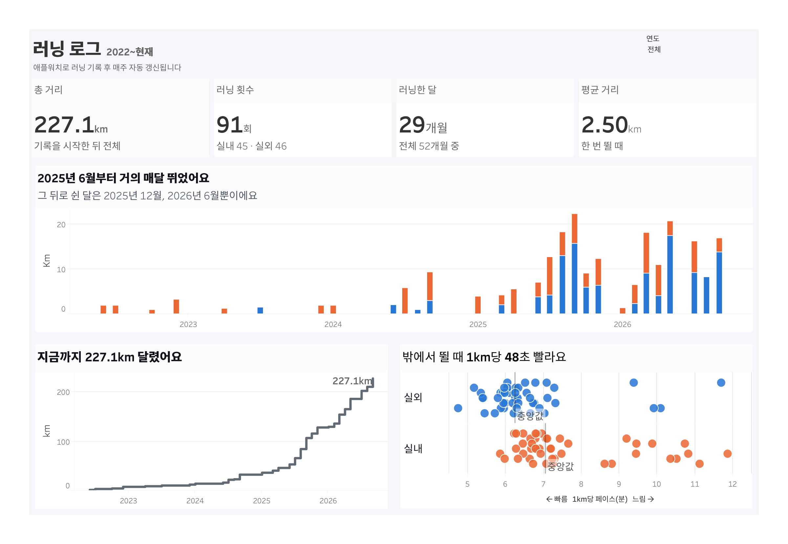

# 내 러닝 기록 대시보드

애플 피트니스(애플워치)에 쌓인 내 러닝 기록으로 "나는 언제, 어떤 조건에서 잘 뛰는가"를 보여주는 대시보드 프로젝트입니다.

**대시보드 보기:** [Tableau Public – Running Log Dashboard](https://public.tableau.com/app/profile/hyounjin.bae/viz/RunningLogDashboard/sheet7)

[](https://public.tableau.com/app/profile/hyounjin.bae/viz/RunningLogDashboard/sheet7)

## 주요 발견 (2022-06 ~ 2026-09, 러닝 91회)

- **총 227.1km**를 달렸고, 기록 기간 52개월 중 29개월 동안 뛰었습니다.
- **2025년 6월부터 거의 매달** 뛰었습니다. 그 뒤로 쉰 달은 2025년 12월, 2026년 6월 두 번뿐입니다.
- **밖에서 뛸 때 1km당 48초 빠릅니다.** 중앙 페이스 기준 실외 6'15", 실내(러닝머신) 7'04"입니다. 러닝머신 거리는 GPS가 아닌 손목 움직임으로 추정한 값이라 실내 페이스에는 측정 오차가 있을 수 있습니다.

## 대시보드로 답할 질문

1. **꾸준함**: 언제 많이 뛰었고 언제 쉬었나? 월별 거리는 어떻게 늘어났나?
2. **실내 vs 실외**: 러닝머신과 밖에서 뛸 때 페이스가 얼마나 다른가?

## 데이터

- 출처: 아이폰 건강 앱 → "모든 건강 데이터 내보내기" (애플워치 + 나이키 런클럽 기록, 2022-06 ~ 2026-09)
- 원본 건강 데이터, 러닝 시작 시각, 경로(GPS)는 개인정보라 저장소와 대시보드에 올리지 않습니다.

### 정리 기준

| 기준 | 이유 |
|---|---|
| 1km당 12분 초과 기록 제외 | 걷기나 중간에 멈춘 기록이 섞여 있음 |
| 거리 0.5km 미만 제외 | 기록 오류 |
| 두 앱에 중복 기록된 러닝은 애플워치 기록만 사용 | 애플워치 기록에만 심박이 있음 |

아침/저녁 비교와 기온 분석은 뺐습니다. 러닝 대부분이 저녁이고, 기온이 기록된 실외 러닝이 적어서입니다.

## 업데이트 구조

```
아이폰 건강 앱 내보내기 → 맥으로 AirDrop
  → launchd가 다운로드 폴더 변화를 감지해 src/update.py --watch 실행
  → 시트에서 직접 채운 평균심박 가져오기 → 러닝 추출(가져온 값으로 덮어쓰기) → 정리
  → 구글 시트에 없는 기록ID만 추가 (월별 탭 재계산) → 전부 올라간 것을 확인하면 zip 삭제
  → Tableau Public이 구글 시트를 하루 1번 동기화
```

| 파일 | 역할 |
|---|---|
| `src/sync_from_sheet.py` | 시트에서 직접 채운 평균심박 → `data/sheet_overrides.csv` |
| `src/parse_runs.py` | 건강 데이터 zip → `data/runs.csv` (시트에서 가져온 평균심박 반영) |
| `src/clean_runs.py` | 정리 + 기록ID 부여 → `data/runs_clean.csv`, `data/monthly.csv` |
| `src/upload_sheet.py` | 시트에 없는 기록만 업로드하고, 전부 올라갔는지 확인 |
| `src/update.py` | 위 네 단계 실행 후 zip 삭제 (`--watch`: 자동 실행용) |
| `src/common.py` | 공통 경로, 기록ID, 시트 연결 함수 |
| `apps_script/Code.gs` | 구글 시트 쪽 웹 앱: 중복 거르기, 월별 요약 |
| `launchd/…plist` | 다운로드 폴더 감시 설정 |

직접 실행: `python src/update.py` (확인만: `--dry-run`)

## 도구

Python(pandas)으로 데이터 정리, Tableau Public으로 대시보드 제작
